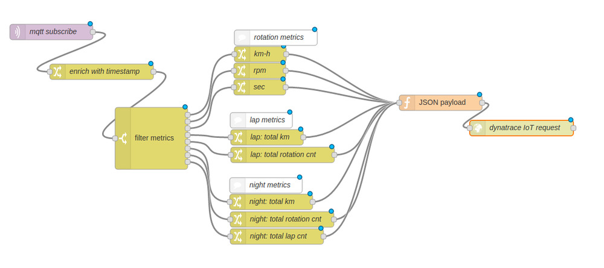

# Building a hamster fitness tracker using Dynatrace API

Wanna build a hamster fitness tracker? See the [blog post](https://www.dynatrace.com/blog/building-a-hamster-fitness-tracker-using-dynatrace-api/).

## Node-RED

Find the source for the used Node-RED flow [here](https://github.com/dtSarah/hamster-wheel/blob/master/node-red/node-red-flow.json).

