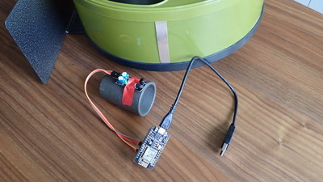

# Building a hamster fitness tracker using Dynatrace API

Wanna build a hamster fitness tracker? See the [blog post](https://www.dynatrace.com/blog/building-a-hamster-fitness-tracker-using-dynatrace-api/).

## Required hardware
* Hamster
* Hamster wheel – with a large enough diameter eg “Silent Runner” ~30cm
* Microcontroller with an integrated wifi chip (ESP8266) – eg a [NodeMCU](http://nodemcu.com/index_en.html)
* Infrared obstacle avoidance sensor – eg KY-032
* Small reflector stripe (eg aluminum foil)

## Software setup
* MQTT broker – eg [Mosquitto](https://mosquitto.org/)
* Node-Red
* Dynatrace SaaS

### Microcontroller
I used a Node MCU - find the source for it [here](node_mcu/hamster_wheel.ino).

### Node-RED

Find the source for the used Node-RED flow [here](node-red/node-red-flow.json).

